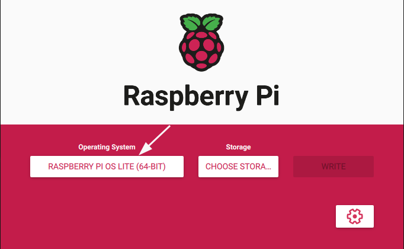
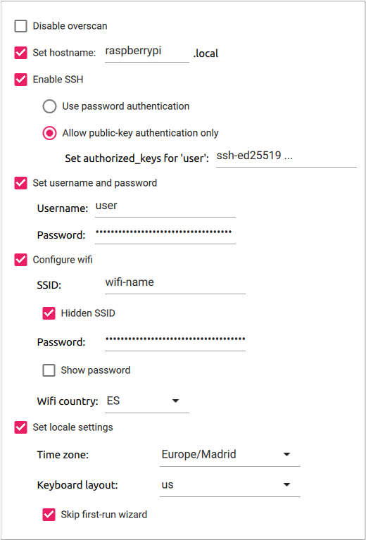

# Raspberry PI 4 Setup

## Getting Started
Install an operating system withouth an user interface.

Configure Advanced Options.

Configure Persistent Settings.

Write the storage with the configured operating system and insert the SD card into the Raspberry Pi.

## Cheet Sheet

Use `make env=<environment>` to build the environment. The environment is the name of the file that contains the Ansible inventory. Check the `example` file for an example. This command will apply the `site.yml` Ansible playbook. It also will check the dependencies that the project requires and the requirements, Ansible collections and roles.

With `make ping env=<environment>` you can check the connection with the hosts defined in the inventory file.

Run `make lint` to check the code style using [yamllint](https://github.com/adrienverge/yamllint).

---

See the [FEATURES.md](doc/FEATURES.md) for more information.
