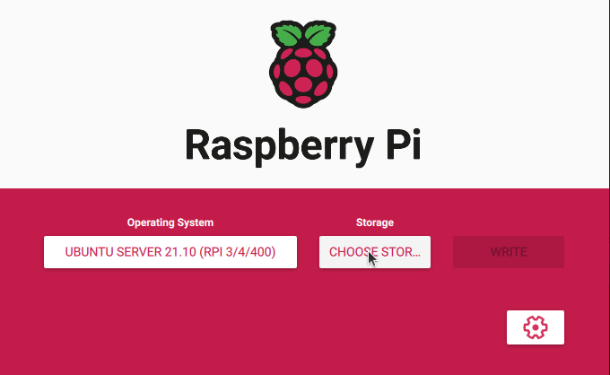
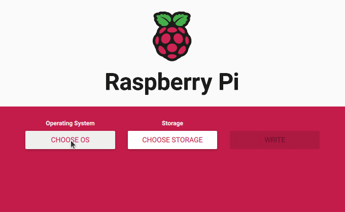
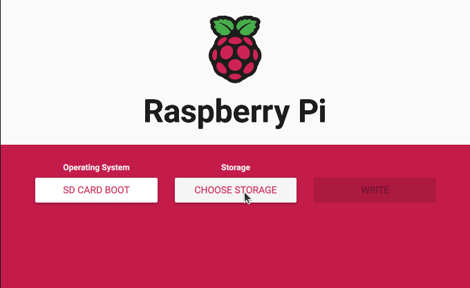

# First Steps

- [First Steps](#first-steps)
	- [Directly boot your Raspberry PI 4 from a USB drive](#directly-boot-your-raspberry-pi-4-from-a-usb-drive)
		- [Install the operating system on the USB drive](#install-the-operating-system-on-the-usb-drive)
		- [Boot the operating system from the USB drive](#boot-the-operating-system-from-the-usb-drive)
	- [Troubleshooting](#troubleshooting)
		- [Configure the Raspberry PI 4 to boot from USB](#configure-the-raspberry-pi-4-to-boot-from-usb)
		- [Write the bootloader image to the SD card](#write-the-bootloader-image-to-the-sd-card)
		- [Update the Raspberry PI 4 boot code EEPROM](#update-the-raspberry-pi-4-boot-code-eeprom)

## Directly boot your Raspberry PI 4 from a USB drive

### Install the operating system on the USB drive

> ⚠️ **Important**: Install at least Ubuntu Server 21.10 (Focal Fossa) to be able to boot from USB.

Choose the storage selecting the USB drive.

### Boot the operating system from the USB drive

1. Disconnect the power supply from your Raspberry PI.
2. Insert the USB drive into a USB 2 port. So one of the black ones. Not the blue ones.
3. Connect the power supply to your Raspberry PI.

If all works okay, then try USB 3 by following these steps:

1. Shutdown the Raspberry PI operating system.
2. Disconnect the power supply from your Raspberry PI.
3. Insert the USB drive into a USB 3 port. So one of the blue ones this time.
4. Connect the power supply to your Raspberry PI.

## Troubleshooting

### Configure the Raspberry PI 4 to boot from USB

Select the bootloader image.

- SD Card Boot – Boot from SD Card if available, otherwise boot from USB.
- USB Boot – Boot from USB if available, otherwise boot from SD Card.

Both options work.

### Write the bootloader image to the SD card

Choose the storage selecting the SD card.

### Update the Raspberry PI 4 boot code EEPROM

To update the boot code stored inside the EEPROM on your Raspberry PI 4, you just need to boot the bootloader image on the SD card once. Perform these steps to do so:

1. Disconnect the power supply from your Raspberry PI.
2. Make sure the USB drive is disconnected from the Raspberry PI.
3. Insert the SD card into its slot on the Raspberry PI.
4. Connect the power supply to your Raspberry PI.

The bootloader image now boots and writes your newly configured boot code to the EEPROM chip. This process only takes a few seconds. When done, the green LED on the Raspberry PI 4 starts to consistently blink about 5 times per second. This indicates that the EEPROM successfully updated. If you attached a display via HDMI, it will turn completely green to indicate the same.

At this point you successfully reconfigured your Raspberry PI 4 to support booting from a USB drive. You can find the instructions for this earlier in this [article](#boot-the-operating-system-from-the-usb-drive). 
